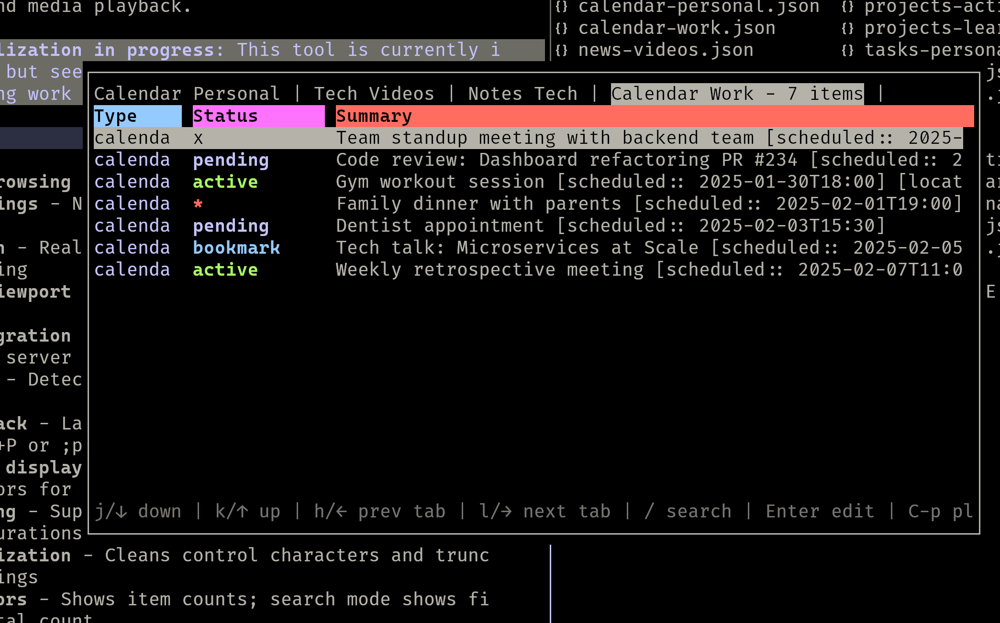

# dv-tui

Terminal UI for browsing and filtering JSON/CSV data with keyboard navigation.

*(Example screenshot with data from [personal-share-example](https://github.com/YlanAllouche/personal-share-example) as displayed in this [dashboard](https://ylanallouche.github.io/dashboard-md/) as well)*


> 💡 **Universalization in progress:** This tool is being generalized for broader use cases. See the `initial-universalizing-effort` branch for ongoing work.

## Features

- **Multi-tab browsing** - Load multiple JSON files as tabs
- **Vim keybindings** - Navigate with j/k, h/l for tabs
- **Fuzzy search** - Real-time filtering with smart character-distance scoring
- **Auto-reload** - Detects and reloads modified files (if not using single-select)
- **Color-coded display** - Dynamic color cycling for statuses; special colors for "focus", "active", and dates
- **Type handling** - Supports string types ("work", "study") and integer durations (shown as minutes)
- **Smart sanitization** - Cleans control characters and truncates long strings
- **Tab indicators** - Shows item counts; search mode shows filtered vs. total count
- **Multiple file formats** - Supports JSON and CSV data files

## Usage

```bash
dv                          # Interactive selection from ~/share/_tmp/
dv file.json                # Open specific file
dv file1.json file2.json    # Multiple files as tabs
dv -s file.json             # Single-select mode (exit after trigerring)
```

or in tmux as a popup window

```bash

bind-key e run-shell "tmux display-popup -w 90% -h 80%  -E ~/.local/bin/dv -s ~/share/_tmp/query1.json ~/share/_tmp/query2.json"
```

## Installation

```bash
pip install -e .
```

## Testing

Sample test data is provided in `tests/data/`:

```bash
# View test work tasks
dv tests/data/work_tasks.json

# View multiple files with tab navigation
dv tests/data/work_tasks.json tests/data/study_tasks.json

# Test CSV support
dv tests/data/mixed_tasks.csv

# Single-select mode
dv -s tests/data/work_tasks.json
```

See `tests/data/README.md` for more testing examples.

## JSON Structure

Expected array of objects with optional fields:

```json
[
  {
    "type": "work",           // string or int (duration in seconds, shown as minutes)
    "status": "active",       // colors: "focus" (magenta), "active" (green), dates (yellow), or custom
    "summary": "Description", // used for search and display
    "file": "path/to/file",   // optional: file path reference
    "line": 42,               // optional: line number (0-indexed)
    "locator": "url_or_id"    // optional: reference identifier
  }
]
```

## Keyboard Shortcuts

| Key | Action |
|-----|--------|
| `j` / `↓` | Move down |
| `k` / `↑` | Move up |
| `h` / `←` | Previous tab |
| `l` / `→` | Next tab |
| `/` | Enter search mode |
| `Tab` / `↓` | Next result (search mode) |
| `Shift+Tab` / `↑` | Previous result (search mode) |
| `Esc` | Exit search (restores position) |
| `Backspace` | Delete search character |
| `q` | Quit |


## Notes

Designed for browsing structured data (JSON/CSV). Optional custom actions can be configured via the `~/.config/dv/config.json` file. The tool is being actively developed for broader use cases.
